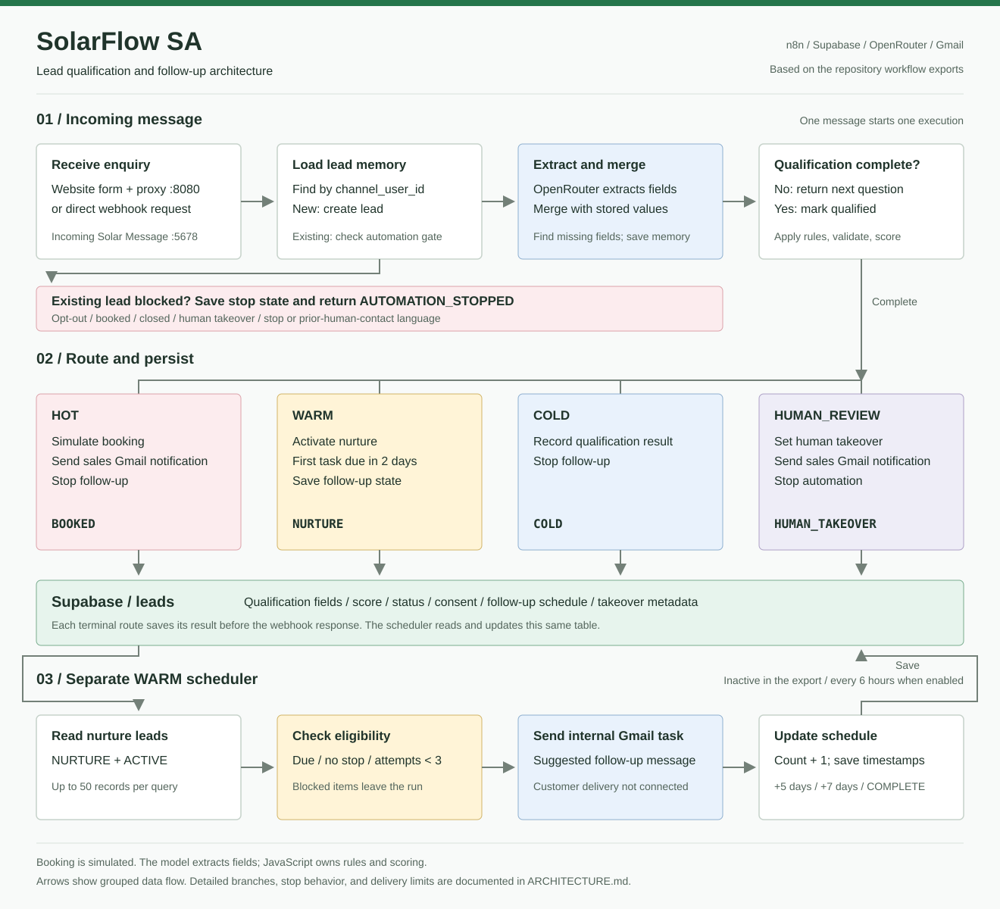

# SolarFlow SA Lead Conversion MVP

SolarFlow SA is a local lead-conversion MVP for South African residential solar installers. It receives inbound enquiries, stores lead memory in Supabase, extracts structured details from customer messages, applies deterministic qualification rules, and routes each lead to the correct next step.

The project is built around a simple split: use the language model for extraction, and use code for business rules. The model reads the customer message and returns structured fields. JavaScript nodes handle validation, scoring, routing, and state changes.

## Architecture



The workflows share lead state through Supabase. The main workflow handles incoming messages; the separate scheduler reads due WARM leads and creates internal follow-up tasks. See [Architecture](docs/ARCHITECTURE.md) for the detailed flow diagrams and current implementation limits.

## Features

- Inbound lead handling through an n8n webhook.
- Persistent lead records in Supabase using `channel_user_id`.
- Structured extraction from natural-language customer messages.
- Missing-field detection and next-question generation.
- Deterministic service-area validation and lead scoring.
- HOT, WARM, COLD, and HUMAN_REVIEW routing.
- Simulated booking for HOT leads.
- Gmail notifications for HOT and HUMAN_REVIEW leads.
- Consent, follow-up, and human-takeover state.
- Separate WARM nurture scheduler workflow.
- Local website form that forwards submissions into the production webhook.

## Current Status

The main workflow is active locally in n8n and has passed smoke tests for the main routes:

- HOT -> `BOOKED`, score 90
- WARM -> `NURTURE`
- COLD -> `COLD`
- HUMAN_REVIEW -> `HUMAN_TAKEOVER`

The WARM nurture scheduler has been imported locally but is intentionally inactive until controlled live testing is approved.

## Project Structure

- `workflows/solar-lead-conversion-mvp.cleaned.json` - current main n8n workflow export.
- `workflows/solarflow-warm-nurture-scheduler.json` - scheduled WARM nurture workflow export.
- `supabase/add_post_qualification_control_fields.sql` - Supabase migration for consent, nurture, and human-takeover fields.
- `website-form/` - local browser form and proxy server for inbound lead capture.
- `tests/route-validation-fixtures.json` - route test payloads and expected outcomes.
- `archive/n8n-control-layer/` - recent workflow backups and helper scripts from the control-layer work.
- `docs/SolarFlow_SA_Project_Source_of_Truth.md` - detailed project reference.
- `BUSINESS_RULES.md`, `DATA_SCHEMA.md`, `WORKFLOW.md`, `AI_PROMPTS.md`, `DECISIONS.md`, `CURRENT_STATUS.md`, and `ROUTE_VALIDATION.md` - supporting project documentation.

## Local Services

n8n runs locally at:

```text
http://localhost:5678
```

Production webhook:

```text
http://localhost:5678/webhook/solar-lead-message
```

Test webhook:

```text
http://localhost:5678/webhook-test/solar-lead-message
```

In n8n test mode, click `Execute workflow` before sending a request to the test webhook. The production webhook is available when the workflow is active.

## Website Form

Start the local website form:

```powershell
$env:SOLARFLOW_FORM_ACCESS_CODE = "change-this-before-sharing"
node .\website-form\server.js
```

Open:

```text
http://localhost:8080
```

The form submits to the production webhook and uses `website_<contact>` as the lead `channel_user_id`.

Website-form logs are written to:

```text
website-form/logs/events.jsonl
```

The log captures malformed JSON, rejected access codes, browser errors, n8n webhook responses, and upstream webhook failures. Access codes are redacted before logging.

## Temporary Public Link

To expose the local website form temporarily:

```powershell
npx localtunnel --port 8080
```

The public link only works while the local form server, n8n, and the tunnel process are running.

## Notes

- Gmail notifications use the n8n credential named `Gmail account`.
- Gmail sends retry once and do not block terminal lead persistence.
- OpenRouter and Supabase nodes retry once before surfacing a workflow failure.
- Booking is currently simulated. Google Calendar integration is a later milestone.
- The project does not yet send direct customer follow-up messages for WARM nurture. The current scheduler sends an internal Gmail task for review.
