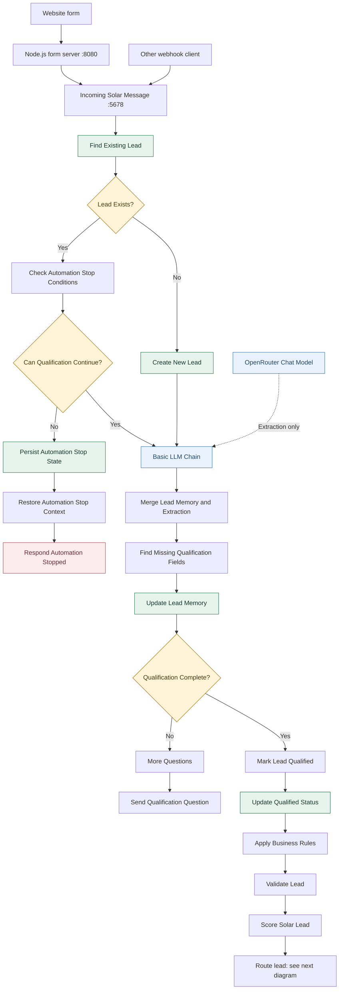
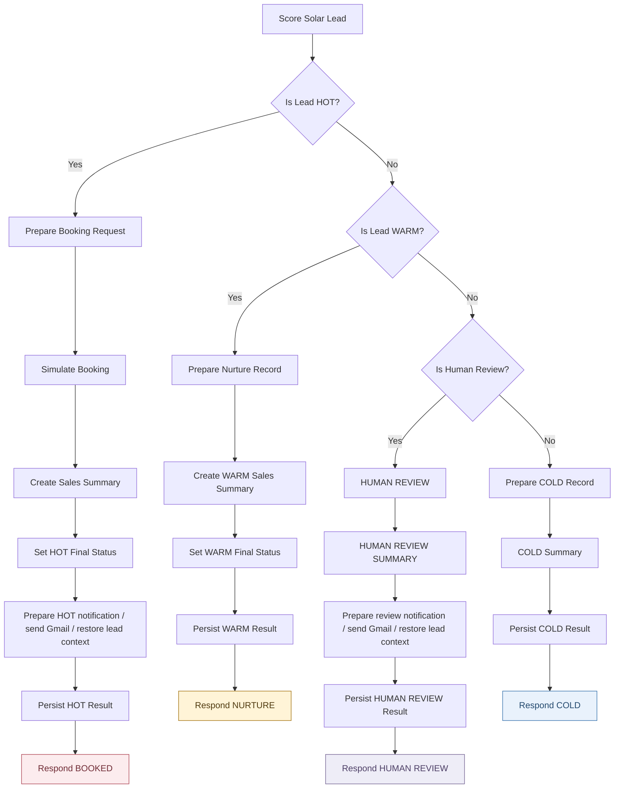
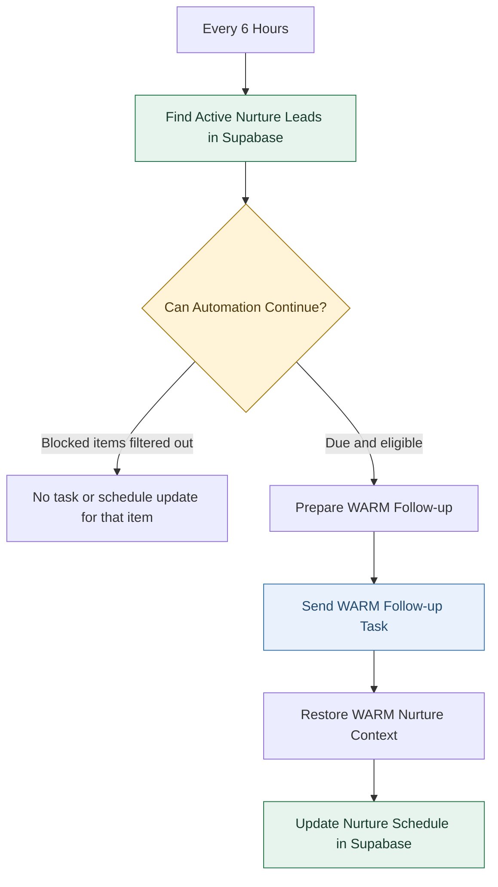

# Architecture

SolarFlow has two n8n workflows. The main workflow handles an incoming message and returns a response. The WARM scheduler runs independently and uses the lead state saved in Supabase to decide which follow-up tasks are due.

These diagrams describe the checked-in [main workflow](../workflows/solar-lead-conversion-mvp.cleaned.json) and [scheduler](../workflows/solarflow-warm-nurture-scheduler.json). Related nodes are grouped where noted; the exports remain the reference for node parameters and connections. The diagrams do not verify the current Docker or n8n runtime state.

## Incoming Message and Qualification

The website form posts through its local Node.js server to the n8n webhook. Other clients can call that webhook directly with `channel_user_id` and `customer_message`.

Supabase identifies returning leads by `channel_user_id`. Existing leads pass through the stop gate before extraction. In the current export, new leads go directly from creation to extraction.

One message produces one execution. Returning a qualification question ends that execution; the customer's next message starts another one. The merge step preserves stored values when extraction returns missing, empty, or null values.

The existing-lead gate checks opt-out state, `BOOKED`, `CLOSED`, `HUMAN_TAKEOVER`, the `human_takeover` flag, and stop or prior-human-contact language in the latest message. A blocked lead is saved before the workflow returns `AUTOMATION_STOPPED`.

## Scoring and Routing

JavaScript applies business rules and calculates the score. The model does not choose the route. The conditions below follow the exported branch order; notification preparation, Gmail sending, and context restoration are grouped into single diagram nodes.

| Route | Saved state | Action |
| --- | --- | --- |
| HOT | `BOOKED`; follow-up stopped | Simulate booking, notify sales, save, respond. |
| WARM | `NURTURE`; follow-up `ACTIVE` | Set the first due date two days ahead, save, respond. |
| COLD | `COLD`; follow-up stopped | Save the result and respond. |
| HUMAN_REVIEW | `HUMAN_TAKEOVER`; `human_takeover = true` | Prepare takeover metadata, notify sales, save, respond. |

`HUMAN_REVIEW` is the lead temperature and route name; `HUMAN_TAKEOVER` is its saved process state. HOT booking is simulated, with no calendar reservation.

## WARM Follow-Up Scheduler

The scheduler export is inactive. When enabled, it is configured to run every six hours. It queries up to 50 leads with `lead_status = NURTURE` and `follow_up_status = ACTIVE`, then filters those results in code.

The gate requires a valid due date at or before the current time and fewer than three attempts. It blocks opted-out leads, terminal stop states, and human takeover. `UNKNOWN` consent currently passes this gate; it is not treated as explicit opt-in.

The Gmail node sends an internal task with a suggested customer message. It does not deliver that message to the customer. The blocked branch in the diagram represents items removed by the code node, not a separate n8n output connection.

| Event | Schedule update |
| --- | --- |
| Lead enters WARM nurture | First task due in 2 days. |
| First task attempt | Count becomes 1; next due date is 5 days after that run. |
| Second task attempt | Count becomes 2; next due date is 7 days after that run. |
| Third task attempt | Count becomes 3; status becomes `COMPLETE`; next due date is cleared. |

These are relative delays, so actual execution time depends on the scheduler run. The count records internal task attempts, not confirmed customer contact. The scheduler Gmail node retries once; unlike the main workflow's notification nodes, it is not configured to continue on failure. A node failure after retries stops execution before the schedule update.

## Shared State and Implementation Limits

Supabase connects the workflows through stored data, not a direct workflow call. It holds qualification fields, scores, statuses, consent, follow-up timestamps and counts, and takeover metadata. See [Data Schema](../DATA_SCHEMA.md) for field definitions.

- The main stop gate is on the existing-lead branch. New leads bypass it in the current export.
- The scheduler checks a fetched snapshot before sending. The export does not implement an atomic claim or a second state read immediately before delivery.
- Gmail errors do not block terminal persistence in the main workflow. Extraction or Supabase failures can stop an execution.
- Direct customer nurture delivery, real calendar booking, and an operator release interface are not shown because they are not implemented in these exports.
- The `Qualification Complete?` false branch is shown as it exists today; its later review remains separate work.

When workflow connections or scheduling rules change, update this page and the [overview SVG](assets/solarflow-architecture.svg) alongside the exports.
